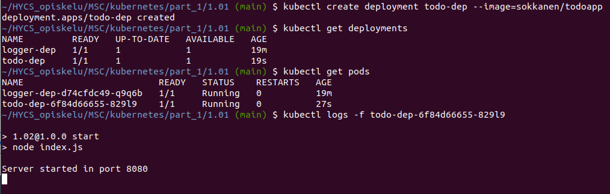

## 1.02

### Building and pushing image

1. docker build -t todoapp .
2. docker tag logger sokkanen/todoapp
3. docker push sokkanen/todoapp

### Kube deployment

1. kubectl create deployment todo-dep --image=sokkanen/todoapp
2. kubectl logs -f todo-dep-<hash>

