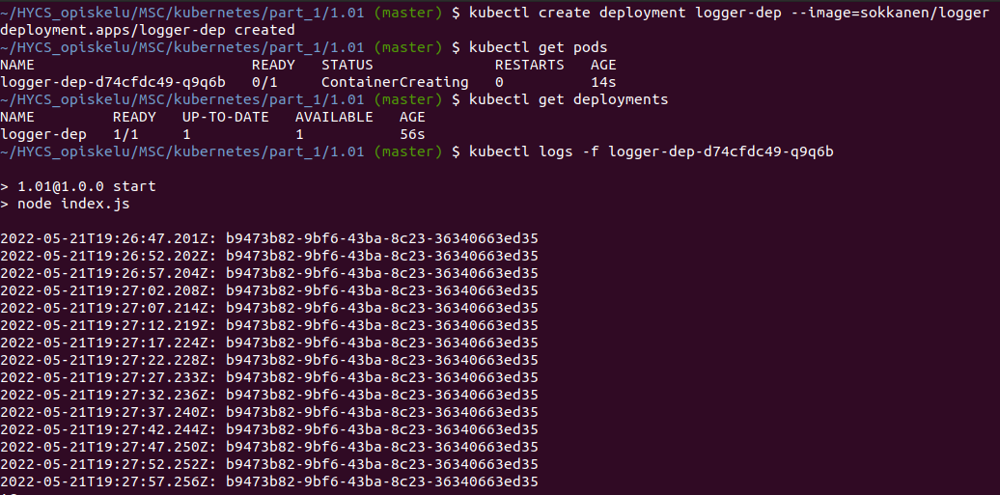
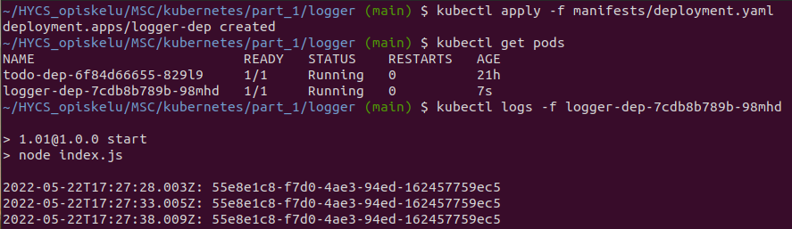
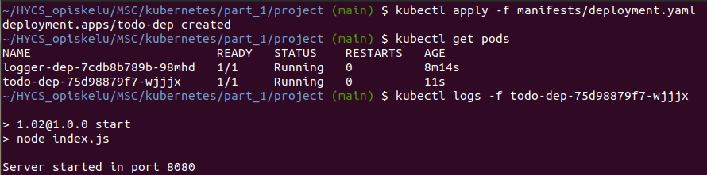
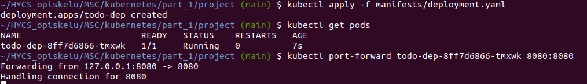
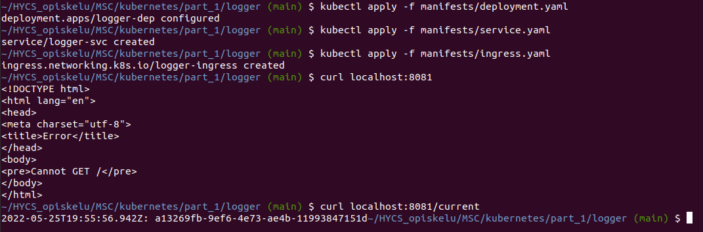
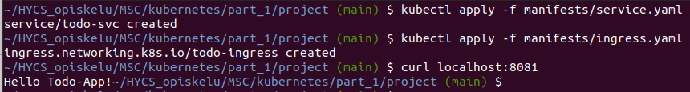
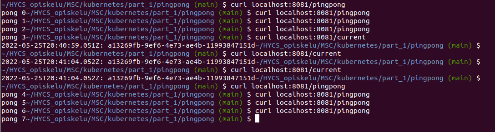
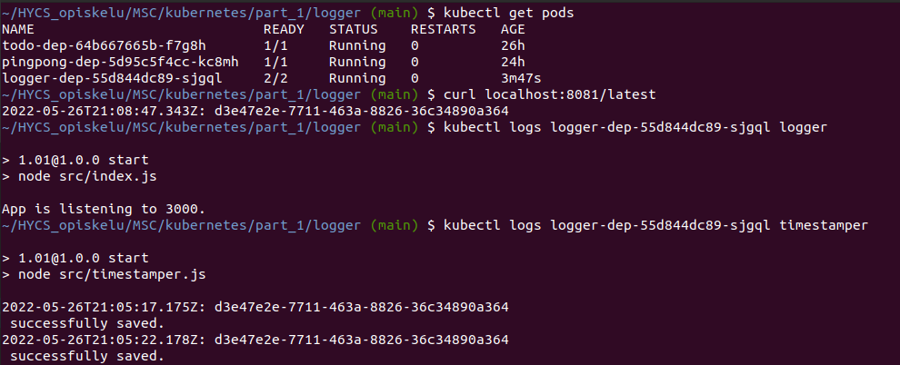

## 1.01 - Logger

### Building and pushing image

1. docker build -t logger .
2. docker tag logger sokkanen/logger
3. docker push sokkanen/logger

### Kube deployment

1. k3d cluster create -a 2
2. kubectl create deployment logger-dep --image=sokkanen/logger
3. kubectl logs -f logger-dep-d74cfdc49-q9q6b

## 1.02 - Project

### Building and pushing image

1. docker build -t todoapp .
2. docker tag logger sokkanen/todoapp
3. docker push sokkanen/todoapp

### Kube deployment

1. kubectl create deployment todo-dep --image=sokkanen/todoapp
2. kubectl logs -f todo-dep-< hash >

## 1.03 - Logger

### Kube deployment

1. kubectl apply -f manifests/deployment.yaml
2. kubectl logs -f logger-dep-< hash >

## 1.04 - Project

### Kube deployment

1. kubectl apply -f manifests/deployment.yaml
2. kubectl logs -f todo-dep-< hash >

## 1.05 - Project

Exposed port in Dockerfile.

### Kube deployment

1. kubectl apply -f manifests/deployment.yaml
2. kubectl port-forward todo-dep-< hash > 8080:8080

## 1.06 - Project

Created service.yaml

### Kube deployment

- kubectl apply -f manifests/service.yaml

## 1.07 - Logger

- Update to application.
- Creating ingress.yaml & service.yaml

### Kube deployment

1. kubectl apply -f manifests/deployment.yaml
2. kubectl apply -f manifests/service.yaml
3. kubectl apply -f manifests/ingress.yaml

## 1.08 - Project

- Created ingress.yaml
- Modified service.yaml from NodePort to ClusterIP

### Kube deployment

1. kubectl apply -f manifests/service.yaml
2. kubectl apply -f manifests/ingress.yaml

## 1.09 - Logger & PingPong

- Created PingPong application with deployment.yaml & service.yaml
- Modified logger's ingress.yaml to pass /pingpong to pingpong application
- Deployed everything.

## 1.10 - Logger & Timestamper

- Created Timestamper application to create file entries.
- Modified Logger to read last line of the shared file (../files/entries.txt)
- Modified logger's deployment.yaml to share volume with timestamper
- Re-Deployed logger-dep.

