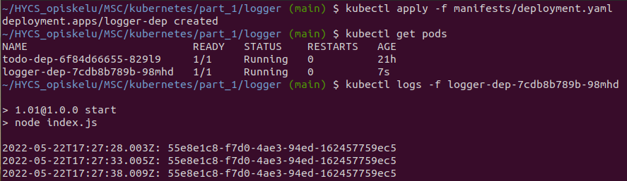
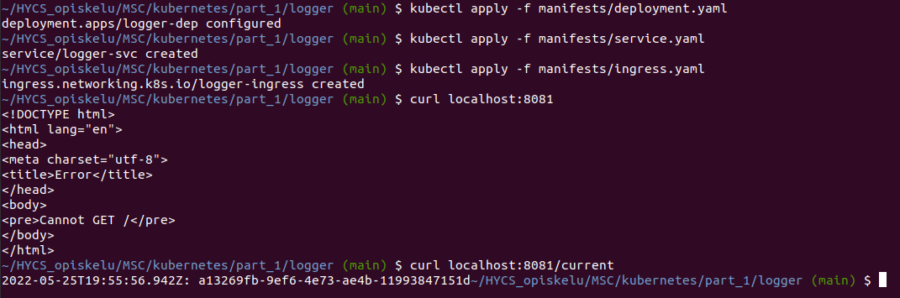

## 1.01

### Building and pushing image

1. docker build -t logger .
2. docker tag logger sokkanen/logger
3. docker push sokkanen/logger

### Kube deployment

1. k3d cluster create -a 2
2. kubectl create deployment logger-dep --image=sokkanen/logger
3. kubectl logs -f logger-dep-d74cfdc49-q9q6b

## 1.03

### Kube deployment

1. kubectl apply -f manifests/deployment.yaml
2. kubectl logs -f logger-dep-< hash >

## 1.07

Update to application.
Creating ingress.yaml & service.yaml

### Kube deployment

1. kubectl apply -f manifests/deployment.yaml
2. kubectl apply -f manifests/service.yaml
3. kubectl apply -f manifests/ingress.yaml

