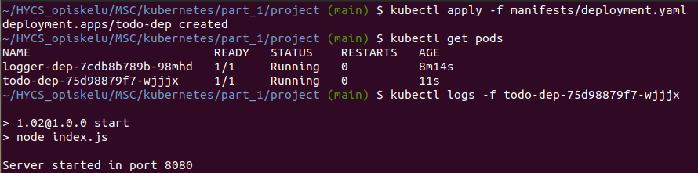
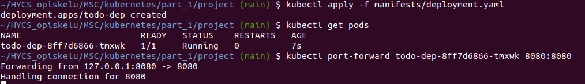
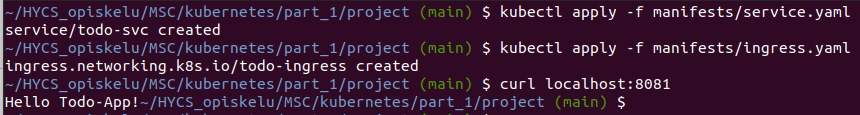

## 1.02

### Building and pushing image

1. docker build -t todoapp .
2. docker tag logger sokkanen/todoapp
3. docker push sokkanen/todoapp

### Kube deployment

1. kubectl create deployment todo-dep --image=sokkanen/todoapp
2. kubectl logs -f todo-dep-< hash >

## 1.04

### Kube deployment

1. kubectl apply -f manifests/deployment.yaml
2. kubectl logs -f todo-dep-< hash >

## 1.05

Exposed port in Dockerfile.

### Kube deployment

1. kubectl apply -f manifests/deployment.yaml
2. kubectl port-forward todo-dep-< hash > 8080:8080

## 1.06

Created service.yaml

### Kube deployment

- kubectl apply -f manifests/service.yaml

## 1.08

Created ingress.yaml
Modified service.yaml from NodePort to ClusterIP

### Kube deployment

1. kubectl apply -f manifests/service.yaml
2. kubectl apply -f manifests/ingress.yaml

