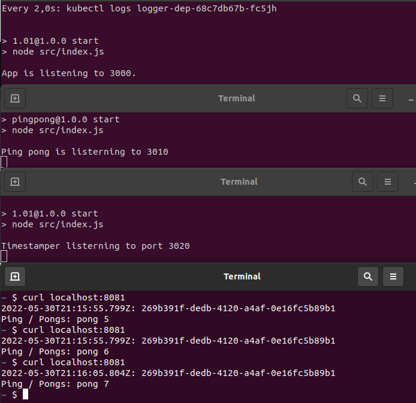
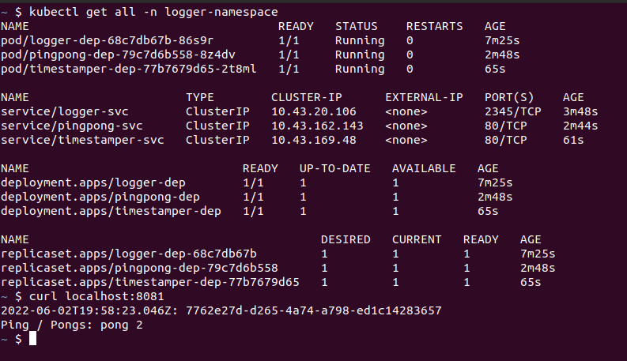
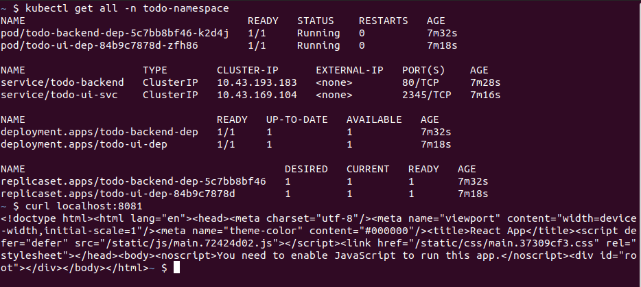
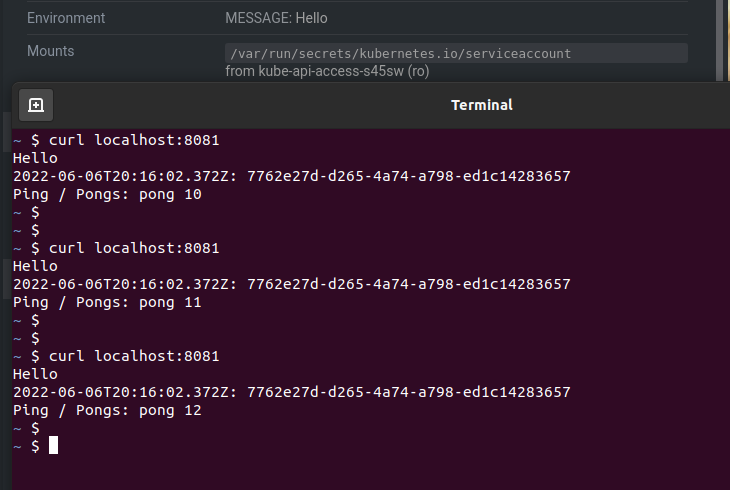
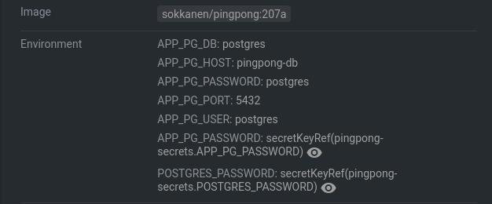
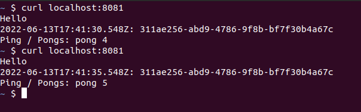
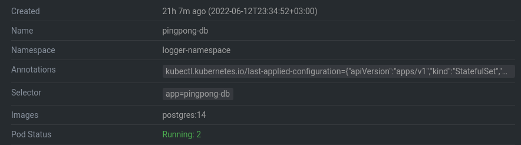
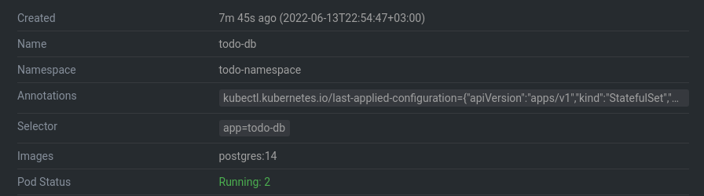
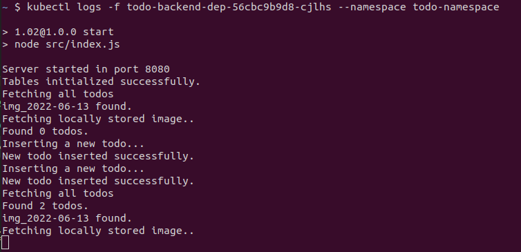
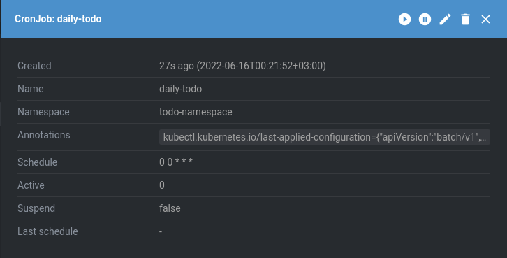

## 2.01 - Logger, PingPong & Timestamper

### Steps

- Modified both Timestamper and Pingpong to not save on volume, but to response to HTTP-request
- Created services for both Timestamper and Pingpong
- Commented out all the volumes
- Modified Logger application & Logger's deployment, service & ingress.

### Output

## 2.02 - Project

### Steps

- Total rebuild for project (apps/project & apps/project_front)
  - UI With React and proxying Express BFF
  - Backend with Express
- Re-applying deployments, services and ingress for the backend.

### Output

## 2.03 - Logger, PingPong & Timestamper

### Steps

- Created namespace `logger-namespace`
- Deployed everything to the new namespace

### Output

## 2.04 - Project (todoapp)

### Steps

- Created namespace `todo-namespace`
- Deployed everything to the new namespace

### Output

## 2.05 - SOPS

Read and understood.

## 2.06 - Logger

### Steps

- Created configmap `logger-configmap`
- Passed the value from configmap as env to the deployment
- Deployed configmap & deployment

## 2.07 - PingPong (Logger)

### Steps

- Deployed PSQL as a statefulSet to the cluster.
- Updated the pingpong app to store ping/pong count to psql.
- Created `configmap.yaml` for both pingpong & pingpong-db
- Created `secret.yaml`, which was encrypted with age + sops.
- Deployed configmaps, secret & updated deployment

### Output

## 2.08 - Project (Todoapp)

### Steps

- Deployed PSQL as a statefulSet to the cluster.
- Updated the project backend to store todos to psql.
- Minor update to frontend source / deployment
- Created `configmap.yaml` for both todo backend & todo-db
- Created `secret.yaml`, which was encrypted with age + sops.
- Deployed configmaps, secret & updated deployment

### Output

## 2.09 - Project (Todoapp)

### Steps

- Created a Cronjob with a simple `wiki.sh` script
- Deployed the cronjob
- Tested that the job works by altering the crontable
- (Source under ../apps/daily_todo/)

### Output

