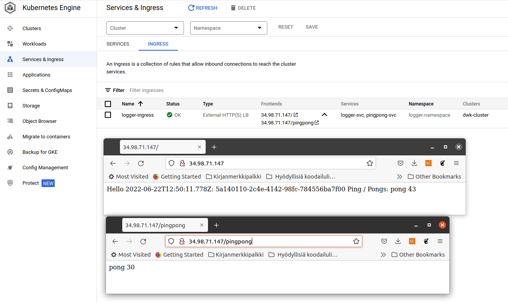
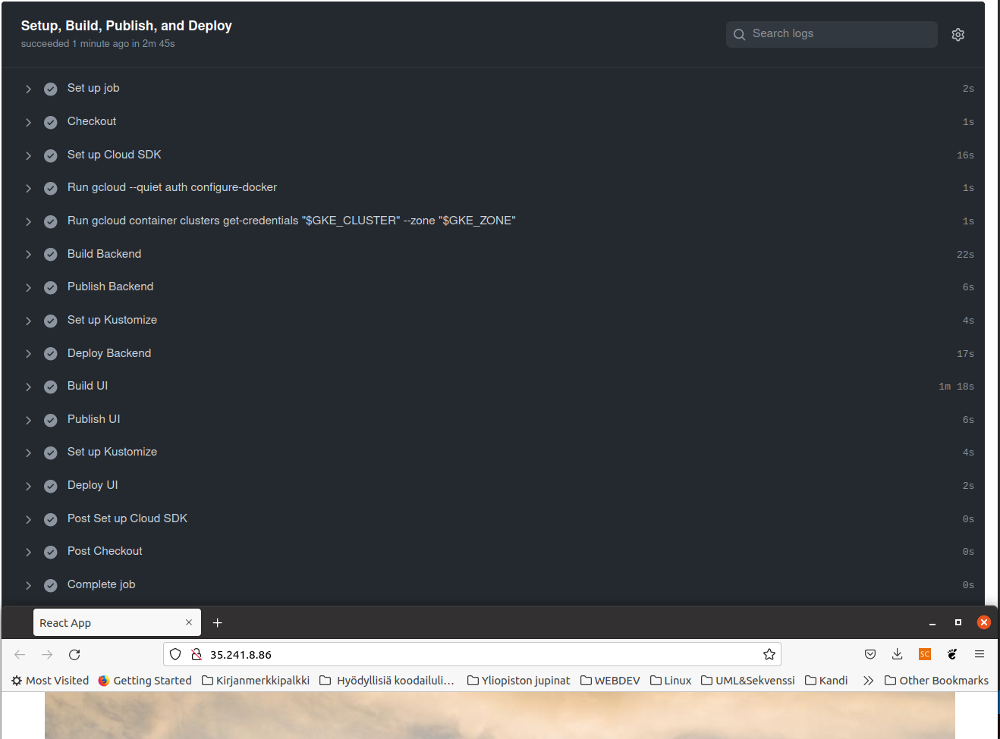
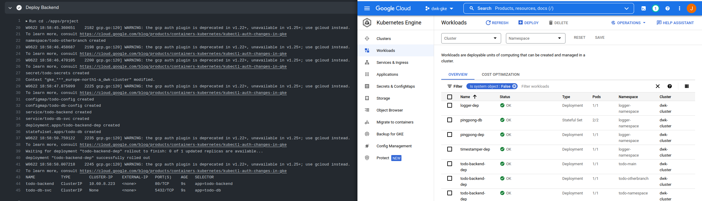
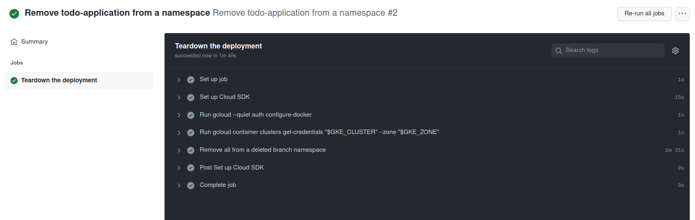
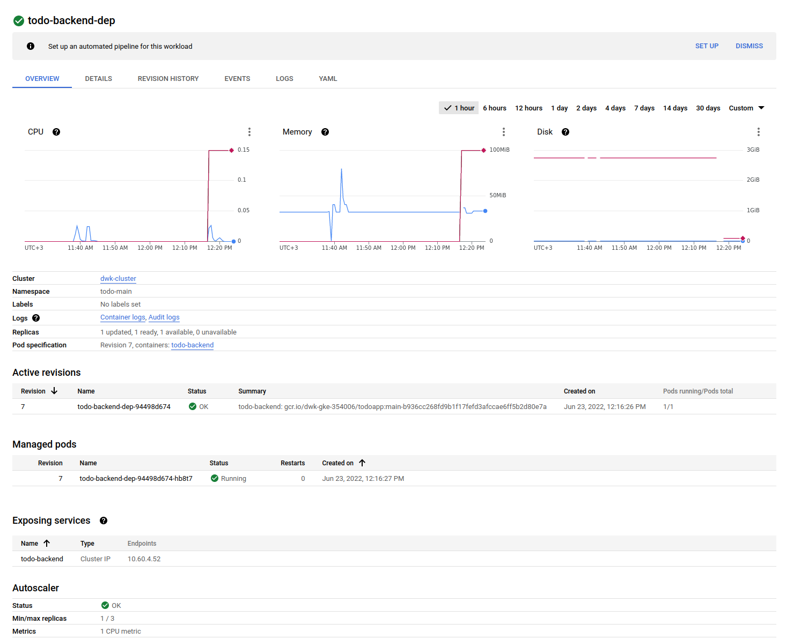
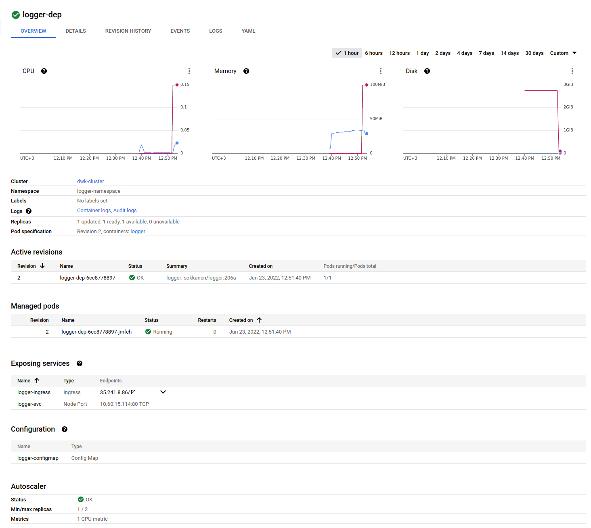
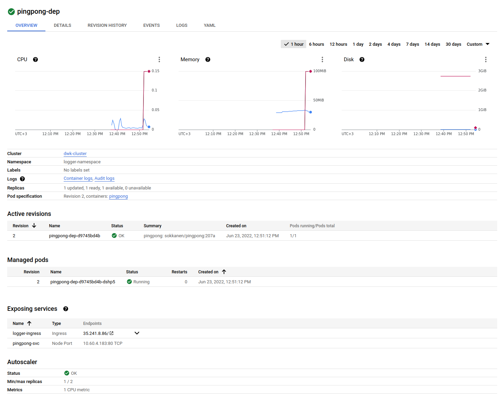
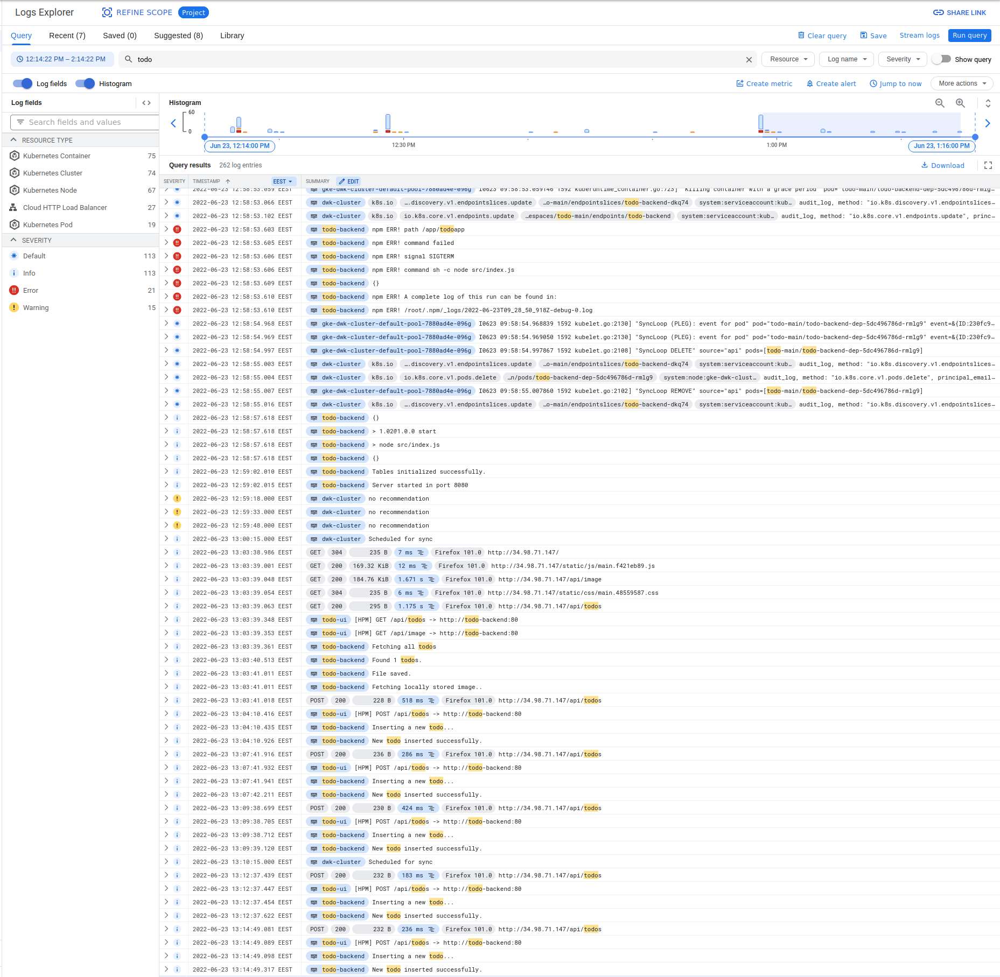

## 3.01 - PingPong

### Steps

- Deployed PingPong app & db to GKE
- Created loadbalancer.yaml to route requests to PingPong

### Output

## 3.02 - Logger

### Steps

- Deployed Rest of the logger stack to GKE
- Configured NodePorts for Logger & PingPong
- Configured Ingress with 2 backends

### Output

## 3.03 - Project (TodoApp)

### Steps

- Minor adjustments to application .yaml's.
- kustomization.yaml for both backend and frontend
- GitHub workflow for building & Deploying the Application

### Output

## 3.04 - Project (TodoApp)

### Steps

- Refactored GitHub action to create new deployment in a namespace `todo-<BranchName>`

### Output

## 3.05 - Project (TodoApp)

### Steps

- Created a new GitHub action `todoapp-delete.yaml` for removing namespace `todo-<BranchName>` in the case of branch deletion.
- Tested & Working

### Output

## 3.06 - DBaaS vs DIY

### DIY:
-  &#43; No vendorlock when using a DIY database
-  &#43; Can run any database with any extension
-  &#45; No automated backup tools available. Backups must be done manually with, for example, cronjob, cloud function and a storage bucket. All of this adds to the total cost.
-  &#45; Maintaining the database has to be done manually through additional deployments (e.g. PgAdmin)
-  &#45; Difficult to span the database accross multiple zones / regions (resilience & availability).

### DBaaS:
-  &#43; Initialization is easy.
-  &#43; Automated maintenance and easy version updates
-  &#43; Automated backup tools ja easy recovery
-  &#43; Easy to span the database instances accross multiple locations (resilience & availability)
-  &#45; Automated maintenance can happen at an uncovinient times
-  &#45; Vendorlock. Migrating the DBaaS database to another location can be really hard
-  &#45; Limited batabase engine versions & extensions.

## 3.07 - Commitment

I will be using Postgres with PersistentVolumeClaims. I have previous experience in working with Google Cloud SQL, so I want to try the another approach during this course.

## 3.08 - Project (TodoApp)

### Steps

- Created a horizontalpodautoscaler.yaml for todo-backend
- Added the newly created autoscaler to kustomization.yaml
- Tested locally & Deployed to GKE

### Output

## 3.09 - Logger, PingPong

### Steps

- Created a horizontalpodautoscaler.yaml for both logger & pingpong deployments.
- Created kustomization.yaml for logger, pingpong & timestamper.
- Tested locally & Deployed to GKE

### Output

## 3.10 - Project (Todoapp)

### Steps

- Logging is enabled by default on a new cluster
- Filtered logs with a word `todo`.

### Output

