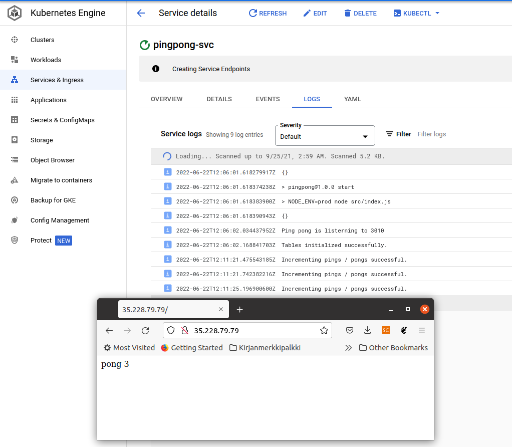

## 3.01 - PingPong

### Steps

- Deployed PingPong app & db to GKE
- Created loadbalancer.yaml to route requests to PingPong

### Output

## 3.02 - Logger

### Steps

- Deployed Rest of the logger stack to GKE
- Configured NodePorts for Logger & PingPong
- Configured Ingress with 2 backends

### Output

