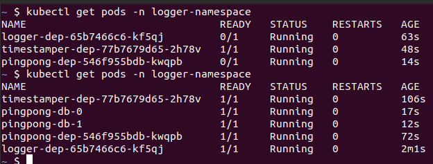
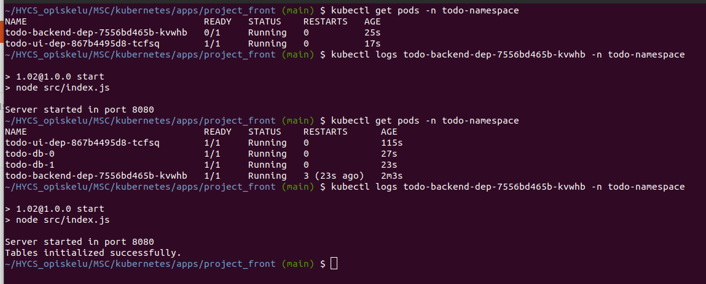
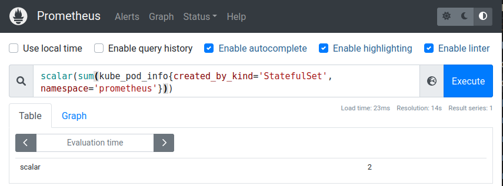
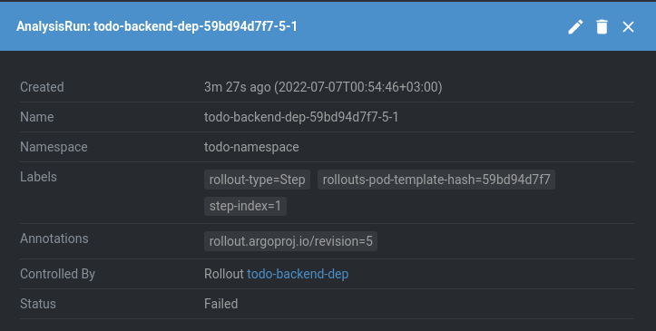
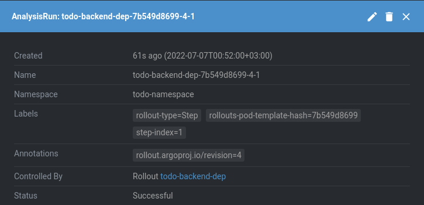

## 4.01 - PingPong & Logger

### Steps

- Created /health -endpoints for both applications
- Tested first by deploying without PingPong's DB. 
- Pods switched to "READY" status after deploying the database.

### Output

## 4.02 - Project

### Steps

- Created /healthz -endpoint for both todoapp
- Tested first by deploying without DB. 
- Pods switched to "READY" status after deploying the database.

### Output

## 4.03 - Prometheus

### Steps

- Started port-forwarding
- Followed the documentation to create the requested query

### Output

## 4.04 - Project

### Steps

- Started Rollout & Analysistemplate for the project backend
- Tested with `result[0] == 0.00` to ensure a failing analysis will prevent deployment.
- Returned to sane values and got a successful rollout.

### Output (Failed)

### Output (Success)

