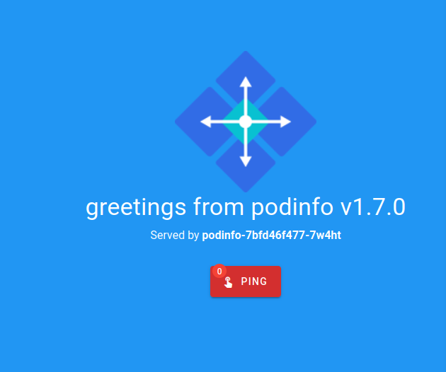

## 5.01 - DIY CRD & Controller

### Steps

- Created App with a Bash script
- Created Controller with JavaScript
- Created needed manifests for Controller
  - clusterrole.yaml
  - clusterrolebinding.yaml
  - deployments.yaml
  - serviceaccount.yaml
- Created needed manifests for Dummysite
  - dummysite.yaml
  - namespace.yaml
  - resourcedefinition.yaml

The implementation works fine with web_urls that respond with 200.
The implementation works with a single DummySite deployment. No logic for pruning old resources or networking for additional sites is in place.

Files in [/5_01](./5_01/) -folder.

### Output

## 5.02 - Project With Linkerd

### Steps

- Created a new cluster
- Created Linkerd -injected versions of the yamls to [/5_02](./5_02/) folder
- Installed Nats with Helm
- Injected NATS with `kubectl get -n todo-namespace deploy -o yaml | linkerd inject - | kubectl apply -f -`

### Output

## 5.03 - Canaries with Linkerd

### Steps

- Went through the Canary release task / demo

### Output

## 5.04 - Openshift vs. Rancher

### Openshift

- An actual Kubernetes Distribution, which adds on top of vanilla K8S.
- Platform as a service (PAAS)
- Created by Red Hat. An opensource container app platform.
- Clusters must be created with Openshift.
- Offers services for single-, multi- and hybrid-cloud solutions as well as on-prem clusters.
- Opinionated approach with a lot of pre-installed tools
- Tightly coupled with Hed Hat infrastructure.

### Rancher

- A toolset for managing clusters either in the cloud or on-prem.
- Can create or import any cluster
- Open source PAAS
- Not as opinionated as Openshift

Even though I should favor one against another, the betterness of a distribution or a toolset
depends totally on current need. For my personal needs, Rancher sounds better, because of the easy installation
and it's ability to import any of my clusters to a single management UI.

## 5.05 - PingPong / Logger / Timestamper in Knative

### Steps

- Updated the envs used by applications. Built & pushed new images with `kna1` tags.
- Created Knative versions of the yamls to [/5_05](./5_05/) folder
- Applied everything but logger. Waited for all the resources to become available before applying logger.yaml.

### Output

## 5.06 Cloud Native Landscape

- I've used **Apache Hadoop** outside of the course.
- I've used **Apache Ignite** outside of the course.
- I've used **Cassandra** outside of the course.
- I've used **IBM DB2** outside of the course.
- I've used **MariaDB** outside of the course.
- I've used **MS SQL Server** outside of the course.
- I've used **MongoDB** outside of the course.
- I've used **MySQL** outside of the course.
- I've used **Neo4j** outside of the course.
- I've used **Oracle** outside of the course, as well as during this course.
- I've used **PostgreSQL** outside of the course.
- I've used **Radis** outside of the course.
- I've used **Flux** outside of the course.
- I've used **Apache Spark** outside of the course.
- I've used **Kafka** outside of the course.
- I've used **RabbitMQ** outside of the course.
- I've used **Docker Compose** outside of the course.
- I've used **Gradle** outside of the course.
- I've used **Azure Pipelines** outside of the course.
- I've used **Circle CI** outside of the course.
- I've used **Github Actions** outside of the course.
- I've used **GitLab** outside of the course.
- I've used **Google Cloud Build** outside of the course.
- I've used **Jenkins** outside of the course.
- I've used **Travis CI** outside of the course.
- I've used **K3S** during and outside of this course.
  - **K3S** uses **Runc** to spawn containers.
  - **K3S** uses **Containerd** as container runtime
  - **K3S** uses **Flannel** for networking
  - **K3S** uses **CoreDNS** for DNS services
  - **K3S** uses **Metrics server**
  - **K3S** uses **Traefik** as Ingress
- I've used **Grafana** during and outside of this course.
  - **Grafana** uses **InfluxData** as it's database
- I've used **Rancher** outside of the course.
- I've used **MS Azure** outside of the course.
- I've used **Google Kubernetes Engine** during and outside of this course. GKE is by far my favorite way to use Kubernetes.
- I've used **Kubernetes** during and outside of this course.
- I've used **etcd** outside of the course.
- I've used **F5** outside of the course.
- I've used **HAPROXY** outside of the course.
- I've used **NGINX** outside of the course.
- I've used **Linkerd** during this course.
- I've used **Google Persistent Disk** outside of the course.
- I've used **Google Container Registry
- I've used **Azure Registry** outside of the course.
- I've used **Kube Bench** outside of the course.
- I've used **OAuth2 Proxy** outside of the course.
- I've used **Keycloak** outside of the course.
- I've used **Prometheus** during and outside of this course.
- I've used **Google Stackdriver** during and outside of this course.
- I've used **Gradle** outside of the course.
- I've used **Splunk** outside of the course.
- I've used **Terraform** outside of the course.
- I've used **Heroku** outside of the course.
- I've used **Helm** outside and during the course.
- I've used **Knative** during the course to create Serverless Apps on K8S.
- I've used **Google Cloud Functions** outside of the course.
- I've used **Azure Functions** outside and during the course.